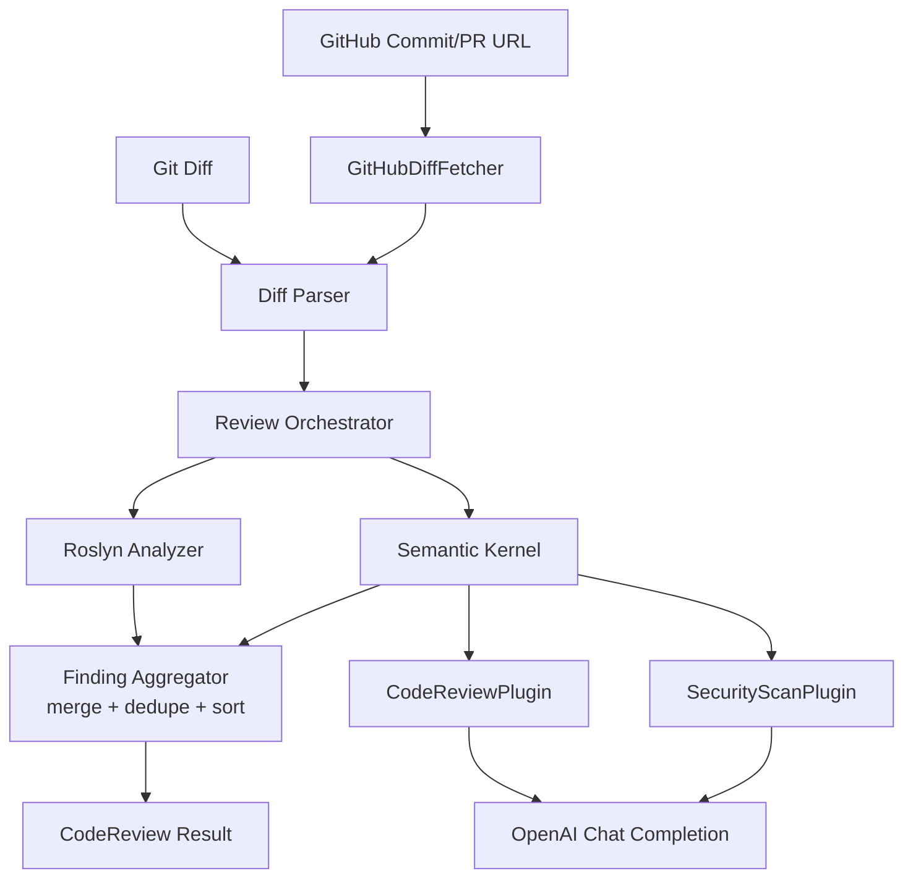

# AI Code Review Assistant

An AI-powered code review API for C# that combines a Large Language Model (via Microsoft
Semantic Kernel) with deterministic static analysis (via Roslyn) to review git diffs and return
structured, actionable findings.

## Overview

Automated code review tools tend to fall into one of two camps: purely rule-based linters that
catch mechanical issues but miss anything requiring judgment, or chatbot-style AI tools that
produce free-form prose you have to read and interpret yourself. Neither integrates cleanly into
a pipeline that expects structured output.

This project takes a git diff of C# changes and produces a single, structured review result
built from:

- **Deterministic findings** from a Roslyn-based static analyzer (empty catch blocks, blocking
  async calls, leftover debugger statements, TODO comments, overly long methods).
- **AI-assisted findings** from an LLM (via Semantic Kernel) that reviews the same diff for
  bugs, security issues, performance problems, and maintainability concerns the deterministic
  checks can't catch.

The two are deduplicated (an AI finding that duplicates a Roslyn finding at the same
file/line/category is dropped) and each returned separately in the API response —
`staticAnalysisFindings` and `aiFindings` — so a consumer can tell which pipeline stage produced
a given finding, weight them differently, or degrade gracefully if the AI review didn't run.
Each finding still carries a severity, category, file, line number (when determinable), problem
description, and suggested fix, so the output can be consumed programmatically (e.g., posted as
PR comments) without any prose parsing.

## Architecture



The solution follows clean architecture:

```
AI.CodeReview.sln
src/
  AI.CodeReview.Domain/          Severity, ReviewCategory, ReviewFinding, CodeReviewResult
                                  — no dependency on anything else in the solution
  AI.CodeReview.Application/     ICodeReviewService, IDiffParser, IStaticCodeAnalyzer,
                                  IAiCodeReviewer abstractions + CodeReviewOrchestrator
                                  — depends only on Domain and abstractions
  AI.CodeReview.Infrastructure/  UnifiedDiffParser, RoslynStaticAnalyzer, Semantic Kernel
                                  integration (Kernel setup, CodeReviewPlugin + SecurityScanPlugin,
                                  prompt templates), GitHubDiffFetcher (diff for a commit/PR URL)
  AI.CodeReview.Api/              ASP.NET Core Web API — POST /api/reviews, DI wiring, Swagger
tests/
  AI.CodeReview.Tests/           xUnit tests for the diff parser, Roslyn analyzer, and
                                  orchestrator (with hand-written fakes for the AI/analysis layers)
samples/
  SampleDiffs/                   Three realistic sample diffs (buggy, performance, clean)
```

Application depends only on Domain and its own abstractions — never on Semantic Kernel, Roslyn,
or ASP.NET Core directly — so the AI provider or static analysis engine could be swapped without
touching the orchestration logic.

## Features

- `POST /api/reviews` accepts either a unified git diff or a GitHub commit/PR URL (exactly one of
  `diff`/`gitUrl`) and returns structured JSON findings.
- Deterministic Roslyn checks: empty catch blocks, `.Result` usage, `.Wait()` usage,
  `Debugger.Break()`/`Debugger.Launch()`, TODO comments, overly long methods (>50 lines).
- AI-assisted review via Semantic Kernel + OpenAI, constrained to structured JSON output that
  maps directly onto the `Severity`/`ReviewCategory` domain enums — a general review pass plus a
  dedicated security-scan pass (hardcoded secrets, SQL/command injection, weak crypto, etc.).
- Findings from both sources are merged, deduplicated (same file/line/category), and sorted by
  severity, then file, then line.
- Strongly typed configuration (Options pattern) for AI provider settings — no `IConfiguration`
  scattered through the codebase, and no hard-coded API keys.
- Global exception handling that never leaks stack traces, provider error details, or secrets to
  API responses.
- Structured logging (`ILogger<T>`) at every pipeline stage, without logging full source code or
  secrets.
- Swagger/OpenAPI documentation for the API.

## Why Semantic Kernel?

Semantic Kernel is doing more here than "calling an LLM":

- **Kernel** — a single `Kernel` instance is configured once (via DI) with the chat completion
  connector (OpenAI, with an Azure OpenAI branch ready to switch to) and reused across requests,
  rather than hand-rolling an HTTP client per call site.
- **Plugins** — `CodeReviewPlugin` (general review) and `SecurityScanPlugin` (a narrower,
  security-only pass — secrets, injection, weak crypto) each package their capability as a
  single-responsibility `[KernelFunction]` with a clear description, one prompt per concern
  rather than one do-everything prompt. Neither is used for open-ended agentic function-calling
  (this app deliberately isn't an agent or a chatbot); `SemanticKernelCodeReviewer` invokes both
  directly, once per changed file, merging their findings.
- **Prompt orchestration** — the review prompt (rules about scope, severity/category vocabulary,
  no invented findings, no duplicates) lives in one template (`CodeReviewPrompt`), built via
  `KernelFunctionFactory.CreateFromPrompt`, separate from the code that calls it.
- **Structured AI interaction** — the execution settings set `ResponseFormat` to a typed DTO
  (`AiFindingsResponse`), so OpenAI returns JSON conforming to that shape directly, instead of
  free-form prose that would need brittle regex/string parsing. The response is still validated
  (severity/category strings are parsed against the domain enums, with invalid entries dropped
  and logged) before being trusted.

## Why Roslyn?

LLM output is probabilistic — even a well-constrained prompt can occasionally miss an obvious
issue or phrase something inconsistently. Roslyn-based static analysis is deterministic: the same
input always produces the same findings, with no API cost, no network dependency, and no risk of
hallucination. Pairing the two means the review doesn't depend entirely on the AI provider being
available or correct, and it demonstrates the two approaches are complementary rather than
redundant — Roslyn catches "always report this" patterns instantly and for free, and Semantic
Kernel handles everything Roslyn couldn't be codified to catch.

One tradeoff worth calling out: the analyzer parses each file's *added diff lines* directly
(`CSharpSyntaxTree.ParseText`), not a full compilable file, since a diff doesn't contain the
whole file. Roslyn's parser is error-tolerant and still produces usable syntax nodes for
fragments like a lone `catch` block or a method body, which is sufficient for these syntactic
checks — but there's no semantic model/symbol binding available (e.g. it can't tell whether
`.Result` is really being accessed on a `Task`). Full-file/semantic analysis is listed under
Future Improvements.

## Setup

**Prerequisites:** [.NET 8 SDK](https://dotnet.microsoft.com/download/dotnet/8.0), an OpenAI API
key.

1. **Clone the repository**

   ```bash
   git clone <repo-url>
   cd SemanticReview
   ```

2. **Configure your AI credentials.** Never put a real key in `appsettings.json` (it's committed
   with a placeholder). Recommended: set the `OPENAI_API_KEY` environment variable — it's read
   directly and always takes priority over anything bound from `AI:ApiKey`:

   ```bash
   export OPENAI_API_KEY="sk-..."          # bash
   $env:OPENAI_API_KEY = "sk-..."          # PowerShell
   ```

   Set it via the OS (System Properties on Windows, shell profile on macOS/Linux) rather than
   inline before `dotnet run`, and open a **new** terminal/IDE window afterward — already-running
   shells won't pick up a change made through the OS environment-variable UI.

   Alternatively, bind through the standard `AI:ApiKey` config key instead (used only if
   `OPENAI_API_KEY` isn't set):

   - `dotnet user-secrets` — `cd src/AI.CodeReview.Api && dotnet user-secrets init && dotnet user-secrets set "AI:ApiKey" "sk-..."`
   - The `AI__ApiKey` environment variable (double underscore, ASP.NET Core's standard nested-config convention)
   - Copy `src/AI.CodeReview.Api/appsettings.example.json` to `appsettings.Development.json` (git-ignored) and fill in `AI:ApiKey`

3. **Restore packages**

   ```bash
   dotnet restore
   ```

4. **Build**

   ```bash
   dotnet build
   ```

5. **Run the API**

   ```bash
   dotnet run --project src/AI.CodeReview.Api
   ```

   Swagger UI is available at `https://localhost:<port>/swagger` in development.

6. **Run a sample request** (see below), or run the tests:

   ```bash
   dotnet test
   ```

## Example Request

```bash
curl -X POST https://localhost:7004/api/reviews \
  -H "Content-Type: application/json" \
  -d @- <<'EOF'
{
  "diff": "diff --git a/src/OrderService.cs b/src/OrderService.cs\nindex 1a2b3c4..5d6e7f8 100644\n--- a/src/OrderService.cs\n+++ b/src/OrderService.cs\n@@ -12,6 +12,14 @@ public class OrderService\n     {\n         _repository = repository;\n     }\n+\n+    public Order GetOrder(int orderId)\n+    {\n+        var order = _repository.GetByIdAsync(orderId).Result;\n+        return order;\n+    }\n }\n"
}
EOF
```

Each sample under `samples/SampleDiffs/` has two files: the `.diff` itself (a realistic unified
diff, useful as-is with real git tooling) and a matching `.request.json` (the exact same content
pre-escaped into a `{"diff": "..."}` body). Pasting a `.diff` file's raw content directly into a
JSON field — e.g. into Swagger UI's "Try it out" box — will fail with a JSON parse error, because
literal newlines aren't valid inside a JSON string; use the `.request.json` file's contents
instead, or generate the escaped body yourself (`node -e "console.log(JSON.stringify({diff:
require('fs').readFileSync('samples/SampleDiffs/buggy-code.diff','utf8')}))"`).

### Reviewing a GitHub commit or PR directly

Instead of `diff`, pass `gitUrl` and the API fetches the diff itself via GitHub's REST API:

```bash
curl -X POST https://localhost:7004/api/reviews \
  -H "Content-Type: application/json" \
  -d '{"gitUrl": "https://github.com/{owner}/{repo}/commit/{sha}"}'
```

Both `https://github.com/{owner}/{repo}/commit/{sha}` and
`https://github.com/{owner}/{repo}/pull/{number}` are recognized (including PR URLs with a
trailing segment like `/files`). Provide exactly one of `diff`/`gitUrl` — both empty or both set
returns `400`. Two limitations, both deliberate MVP scope cuts: **public repositories only** (no
GitHub token is configured, so private repos/commits return `404`), and GitHub's **unauthenticated
API rate limit of 60 requests/hour per IP** applies (returns `400` with a rate-limit message, not
a raw GitHub error, if hit).

## Example Response

```json
{
  "staticAnalysisFindings": [
    {
      "severity": "High",
      "category": "Async",
      "file": "src/OrderService.cs",
      "line": 17,
      "problem": "Synchronous access to Task.Result can cause deadlocks and blocks the calling thread.",
      "suggestion": "Await the task instead of accessing .Result."
    }
  ],
  "aiFindings": [
    {
      "severity": "Medium",
      "category": "ExceptionHandling",
      "file": "src/OrderService.cs",
      "line": 31,
      "problem": "Empty catch block can hide exceptions and make debugging difficult.",
      "suggestion": "Log the exception or handle it appropriately instead of leaving the catch block empty."
    }
  ]
}
```

## Debugging AI Requests/Responses

Semantic Kernel's OpenAI connector handles the actual HTTP call to the model internally — the
app never touches `HttpClient` directly. To see exactly what's sent and received, a filter
(`AiCallLoggingFilter`, registered on the `Kernel` in `SemanticKernelServiceCollectionExtensions`)
logs the fully rendered prompt and the raw model response at `Debug` level.

This is **on by default when running locally** (`appsettings.Development.json` sets
`Logging:LogLevel:AI.CodeReview.Infrastructure.SemanticKernel.AiCallLoggingFilter` to `Debug`) —
the log lines show up wherever you're running the app from: the terminal if you used
`dotnet run`, or your IDE's debug console/output panel if you launched via a debugger.
It's `Information`+ only (i.e. off) in `appsettings.json`/production, since it includes the full
diff content on every request. To enable it somewhere other than local dev (e.g. temporarily in
another environment), set the same key as an environment variable:

```bash
Logging__LogLevel__AI.CodeReview.Infrastructure.SemanticKernel.AiCallLoggingFilter=Debug dotnet run --project src/AI.CodeReview.Api
```

## Architecture Decisions

- **Clean architecture / dependency direction** — Domain has zero dependencies; Application
  depends only on Domain and defines abstractions (`IDiffParser`, `IStaticCodeAnalyzer`,
  `IAiCodeReviewer`) that Infrastructure implements. This is what makes the orchestrator testable
  with hand-written fakes instead of a real AI provider or Roslyn.
- **`CodeReviewResult`, not `CodeReview`, as the domain aggregate's type name** — `CodeReview` is
  what the spec calls it, but it collides with the `AI.CodeReview.*` root namespace shared by
  every project in this solution: C# resolves enclosing-namespace members (like the implicit
  `AI.CodeReview` namespace) before `using`-alias directives, so a type literally named
  `CodeReview` is unreachable by its simple name anywhere under that namespace tree. Renaming the
  type was the only fix that didn't require littering every file with `global::`-qualified names.
- **No agentic function-calling** — per the brief, this is not a chatbot or an agent. Semantic
  Kernel's plugin/function mechanism is used for structured prompt orchestration (one function,
  invoked directly, once per file), not for letting a model choose which functions to call.
- **AI failures degrade gracefully, per file** — if the AI reviewer throws for a file (auth
  failure, rate limit, timeout, malformed response), the orchestrator catches `AiReviewException`
  right there, logs a warning, and keeps that file's deterministic Roslyn findings instead of
  failing the whole request. The AI review is treated as a best-effort enhancement on top of
  Roslyn, not a hard dependency — a missing/invalid API key still returns a `200` with whatever
  Roslyn found, rather than a `500`.
- **Roslyn line numbers are local, then remapped** — the analyzer only sees a reconstructed
  fragment of added lines, so it reports 1-based line numbers local to that fragment. The
  orchestrator (which owns both the parsed diff and the analyzer output) maps those back to real
  diff line numbers using the `ParsedFileDiff.AddedLines` list. AI findings, by contrast, are
  given real line numbers directly in the prompt and used as-is.
- **Options pattern for configuration** — `AiOptions` is bound once from the `"AI"` config
  section; nothing else in the codebase reads `IConfiguration` directly.
- **A failed git-URL fetch is a hard failure, unlike an AI failure** — `GitDiffFetchException`
  from `IGitDiffFetcher` propagates all the way to the controller (`400`), it is not caught inside
  the orchestrator. This is the opposite of how `AiReviewException` is handled: an AI failure
  still leaves Roslyn findings to return, but a failed diff fetch leaves nothing to review at all
  — there's no partial result to degrade to.
- **`SecurityScanPlugin` reuses the general reviewer's structured-output DTO rather than
  introducing a new one** — its prompt just instructs the model to always emit
  `"category": "Security"`, so `SemanticKernelCodeReviewer` has one deserialize/validate path for
  both plugins instead of two near-identical ones. Its call is wrapped in its own try/catch inside
  `ReviewAsync`, independent of the general review's — a security-scan failure logs a warning and
  is dropped, it doesn't discard findings the general review already produced for that file.
  One accepted tradeoff of running two independent AI passes over the same code: they can each
  flag the same underlying issue at slightly different line numbers, which the existing
  `(File, Line, Category)` dedupe won't catch (an exact-line match still dedupes fine).

## Future Improvements

- GitHub PR integration — *posting* findings back as inline PR review comments (the API can
  already *read* a diff from a commit/PR URL; writing results back to GitHub is the remaining
  half).
- Repository-aware RAG — index the surrounding codebase so the AI reviewer has more context than
  just the diff.
- Configurable coding guidelines — let teams supply their own rules to fold into the prompt.
- Full Azure OpenAI support (the provider switch exists in `AiOptions`/DI wiring but is untested
  against a real Azure OpenAI resource).
- GitHub Actions workflow to run reviews automatically on pull requests.
- Persisted review history instead of a stateless request/response API.
- Additional Roslyn analyzers (e.g. `async void`, disposed-object misuse, LINQ-in-loop patterns).
- Semantic-model-based analysis (compiling against real project references) instead of
  syntax-only fragment parsing.
