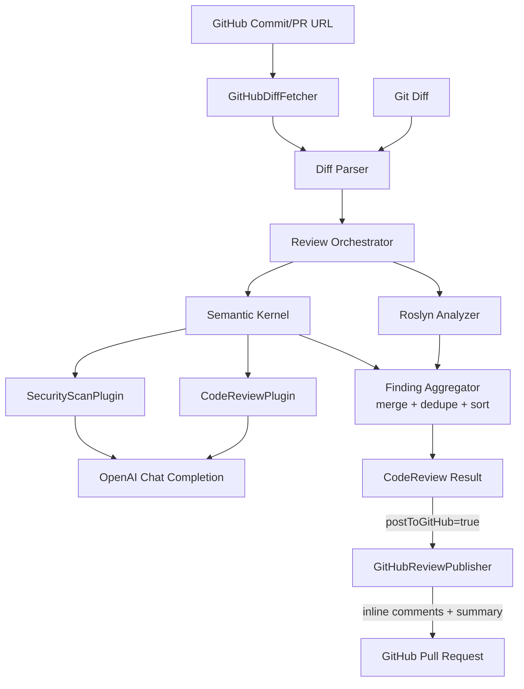

# AI Code Review Assistant

An AI-powered code review API for C# that combines a Large Language Model (via Microsoft
Semantic Kernel) with deterministic static analysis (via Roslyn) to review git diffs and return
structured, actionable findings.

## Overview

Automated code review tools tend to fall into one of two camps: purely rule-based linters that
catch mechanical issues but miss anything requiring judgment, or chatbot-style AI tools that
produce free-form prose you have to read and interpret yourself. Neither integrates cleanly into
a pipeline that expects structured output.

This project takes a git diff of C# changes and produces a single, structured review result
built from:

- **Deterministic findings** from a Roslyn-based static analyzer (empty catch blocks, blocking
  async calls, leftover debugger statements, TODO comments, overly long methods).
- **AI-assisted findings** from an LLM (via Semantic Kernel) that reviews the same diff for
  bugs, security issues, performance problems, and maintainability concerns the deterministic
  checks can't catch.

The two are deduplicated (an AI finding that duplicates a Roslyn finding at the same
file/line/category is dropped) and each returned separately in the API response —
`staticAnalysisFindings` and `aiFindings` — so a consumer can tell which pipeline stage produced
a given finding, weight them differently, or degrade gracefully if the AI review didn't run.
Each finding still carries a severity, category, file, line number (when determinable), problem
description, and suggested fix, so the output can be consumed programmatically (e.g., posted as
PR comments) without any prose parsing.

## Architecture



The solution follows clean architecture:

```
AI.CodeReview.sln
src/
  AI.CodeReview.Domain/          Severity, ReviewCategory, ReviewFinding, CodeReviewResult
                                  — no dependency on anything else in the solution
  AI.CodeReview.Application/     ICodeReviewService, IDiffParser, IStaticCodeAnalyzer,
                                  IAiCodeReviewer abstractions + CodeReviewOrchestrator
                                  — depends only on Domain and abstractions
  AI.CodeReview.Infrastructure/  UnifiedDiffParser, RoslynStaticAnalyzer, Semantic Kernel
                                  integration (Kernel setup, CodeReviewPlugin + SecurityScanPlugin,
                                  prompt templates), GitHubDiffFetcher (diff for a commit/PR URL),
                                  GitHubReviewPublisher (posts findings back as a PR review)
  AI.CodeReview.Api/              ASP.NET Core Web API — POST /api/reviews, DI wiring, Swagger
tests/
  AI.CodeReview.Tests/           xUnit tests for the diff parser, Roslyn analyzer, and
                                  orchestrator (with hand-written fakes for the AI/analysis layers)
.github/
  workflows/review.yml           Self-contained CI job: builds+runs the API, then has it review
                                  and post comments on the pull request that triggered the run
```

Application depends only on Domain and its own abstractions — never on Semantic Kernel, Roslyn,
or ASP.NET Core directly — so the AI provider or static analysis engine could be swapped without
touching the orchestration logic.

## Features

- `POST /api/reviews` accepts either a unified git diff or a GitHub commit/PR URL (exactly one of
  `diff`/`gitUrl`) and returns structured JSON findings.
- Deterministic Roslyn checks: empty catch blocks, `.Result` usage, `.Wait()` usage,
  `Debugger.Break()`/`Debugger.Launch()`, TODO comments, overly long methods (>50 lines).
- AI-assisted review via Semantic Kernel + OpenAI, constrained to structured JSON output that
  maps directly onto the `Severity`/`ReviewCategory` domain enums — a general review pass plus a
  dedicated security-scan pass (hardcoded secrets, SQL/command injection, weak crypto, etc.).
- AI-only review (no Roslyn) for changed files outside C# — TypeScript/JavaScript, Python, Java,
  Go, Ruby, PHP, Razor/`.cshtml`, SQL, YAML, JSON, HTML, and CSS — so a diff that only touches
  those files still gets reviewed instead of being silently skipped.
- Per-file AI review calls run in parallel (bounded to 4 concurrent) instead of one file at a
  time, so multi-file diffs review noticeably faster.
- Transient AI provider failures (timeouts, connection errors, `429`/`5xx`) are retried
  automatically with a short backoff before being treated as a failure for that file.
- Findings from both sources are merged, deduplicated (same file/line/category), and sorted by
  severity, then file, then line.
- Opt-in GitHub write-back — set `postToGitHub` (with a `gitHubToken`) on a PR-URL request and
  findings are posted back as a single GitHub review: findings with a line number become inline
  comments, findings without one are listed in the review's summary instead of being dropped.
- A self-contained GitHub Actions workflow (`.github/workflows/review.yml`) builds and runs this
  API inside the CI job itself and has it review (and post comments on) the pull request that
  triggered the run — no hosted instance required.
- Optional API key authentication — set `Api:ApiKey` and every `/api/*` request must send a
  matching `X-Api-Key` header; unset (the default), the API stays open.
- Strongly typed configuration (Options pattern) for AI provider settings — no `IConfiguration`
  scattered through the codebase, and no hard-coded API keys.
- Global exception handling that never leaks stack traces, provider error details, or secrets to
  API responses.
- Structured logging (`ILogger<T>`) at every pipeline stage, without logging full source code or
  secrets.
- Swagger/OpenAPI documentation for the API.

## Why Semantic Kernel?

Semantic Kernel is doing more here than "calling an LLM":

- **Kernel** — a single `Kernel` instance is configured once (via DI) with the chat completion
  connector (OpenAI, with an Azure OpenAI branch ready to switch to) and reused across requests,
  rather than hand-rolling an HTTP client per call site.
- **Plugins** — `CodeReviewPlugin` (general review) and `SecurityScanPlugin` (a narrower,
  security-only pass — secrets, injection, weak crypto) each package their capability as a
  single-responsibility `[KernelFunction]` with a clear description, one prompt per concern
  rather than one do-everything prompt. Neither is used for open-ended agentic function-calling
  (this app deliberately isn't an agent or a chatbot); `SemanticKernelCodeReviewer` invokes both
  directly, once per changed file, merging their findings.
- **Prompt orchestration** — the review prompt (rules about scope, severity/category vocabulary,
  no invented findings, no duplicates) lives in one template (`CodeReviewPrompt`), built via
  `KernelFunctionFactory.CreateFromPrompt`, separate from the code that calls it.
- **Structured AI interaction** — the execution settings set `ResponseFormat` to a typed DTO
  (`AiFindingsResponse`), so OpenAI returns JSON conforming to that shape directly, instead of
  free-form prose that would need brittle regex/string parsing. The response is still validated
  (severity/category strings are parsed against the domain enums, with invalid entries dropped
  and logged) before being trusted.

## Why Roslyn?

LLM output is probabilistic — even a well-constrained prompt can occasionally miss an obvious
issue or phrase something inconsistently. Roslyn-based static analysis is deterministic: the same
input always produces the same findings, with no API cost, no network dependency, and no risk of
hallucination. Pairing the two means the review doesn't depend entirely on the AI provider being
available or correct, and it demonstrates the two approaches are complementary rather than
redundant — Roslyn catches "always report this" patterns instantly and for free, and Semantic
Kernel handles everything Roslyn couldn't be codified to catch.

One tradeoff worth calling out: the analyzer parses each file's *added diff lines* directly
(`CSharpSyntaxTree.ParseText`), not a full compilable file, since a diff doesn't contain the
whole file. Roslyn's parser is error-tolerant and still produces usable syntax nodes for
fragments like a lone `catch` block or a method body, which is sufficient for these syntactic
checks — but there's no semantic model/symbol binding available (e.g. it can't tell whether
`.Result` is really being accessed on a `Task`). Full-file/semantic analysis is listed under
Future Improvements.

## Setup

**Prerequisites:** [.NET 8 SDK](https://dotnet.microsoft.com/download/dotnet/8.0), an OpenAI API
key.

1. **Clone the repository**

   ```bash
   git clone <repo-url>
   cd SemanticReview
   ```

2. **Configure your AI credentials.** Never put a real key in `appsettings.json` (it's committed
   with a placeholder). Recommended: set the `OPENAI_API_KEY` environment variable — it's read
   directly and always takes priority over anything bound from `AI:ApiKey`:

   ```bash
   export OPENAI_API_KEY="sk-..."          # bash
   $env:OPENAI_API_KEY = "sk-..."          # PowerShell
   ```

   Set it via the OS (System Properties on Windows, shell profile on macOS/Linux) rather than
   inline before `dotnet run`, and open a **new** terminal/IDE window afterward — already-running
   shells won't pick up a change made through the OS environment-variable UI.

   Alternatively, bind through the standard `AI:ApiKey` config key instead (used only if
   `OPENAI_API_KEY` isn't set):

   - `dotnet user-secrets` — `cd src/AI.CodeReview.Api && dotnet user-secrets init && dotnet user-secrets set "AI:ApiKey" "sk-..."`
   - The `AI__ApiKey` environment variable (double underscore, ASP.NET Core's standard nested-config convention)
   - Copy `src/AI.CodeReview.Api/appsettings.example.json` to `appsettings.Development.json` (git-ignored) and fill in `AI:ApiKey`

3. **Restore packages**

   ```bash
   dotnet restore
   ```

4. **Build**

   ```bash
   dotnet build
   ```

5. **Run the API**

   ```bash
   dotnet run --project src/AI.CodeReview.Api
   ```

   Swagger UI is available at `https://localhost:<port>/swagger` in development.

6. **Run a sample request** (see below), or run the tests:

   ```bash
   dotnet test
   ```

## Example Request

```bash
curl -X POST https://localhost:7004/api/reviews \
  -H "Content-Type: application/json" \
  -d @- <<'EOF'
{
  "diff": "diff --git a/src/OrderService.cs b/src/OrderService.cs\nindex 1a2b3c4..5d6e7f8 100644\n--- a/src/OrderService.cs\n+++ b/src/OrderService.cs\n@@ -12,6 +12,14 @@ public class OrderService\n     {\n         _repository = repository;\n     }\n+\n+    public Order GetOrder(int orderId)\n+    {\n+        var order = _repository.GetByIdAsync(orderId).Result;\n+        return order;\n+    }\n }\n"
}
EOF
```

Pasting a raw `.diff` file's content directly into a JSON field — e.g. into Swagger UI's "Try it
out" box — will fail with a JSON parse error, because literal newlines aren't valid inside a JSON
string; escape it first (e.g. `node -e "console.log(JSON.stringify({diff:
require('fs').readFileSync('path/to/your.diff','utf8')}))"`) or use `gitUrl` instead.

### Reviewing a GitHub commit or PR directly

Instead of `diff`, pass `gitUrl` and the API fetches the diff itself via GitHub's REST API:

```bash
curl -X POST https://localhost:7004/api/reviews \
  -H "Content-Type: application/json" \
  -d '{"gitUrl": "https://github.com/{owner}/{repo}/commit/{sha}"}'
```

Both `https://github.com/{owner}/{repo}/commit/{sha}` and
`https://github.com/{owner}/{repo}/pull/{number}` are recognized (including PR URLs with a
trailing segment like `/files`). Provide exactly one of `diff`/`gitUrl` — both empty or both set
returns `400`. Two limitations, both deliberate MVP scope cuts: **public repositories only** (no
GitHub token is configured, so private repos/commits return `404`), and GitHub's **unauthenticated
API rate limit of 60 requests/hour per IP** applies (returns `400` with a rate-limit message, not
a raw GitHub error, if hit).

### Posting findings back to GitHub

Add `postToGitHub: true` and `gitHubToken` to a `gitUrl` request (the `gitUrl` must be a **pull
request** URL, not a commit — there's no PR to attach a review to for a bare commit) and the
computed findings are posted back as a single GitHub review, in the same request:

```bash
curl -X POST https://localhost:7004/api/reviews \
  -H "Content-Type: application/json" \
  -d '{
    "gitUrl": "https://github.com/{owner}/{repo}/pull/{number}",
    "postToGitHub": true,
    "gitHubToken": "<a token with permission to review this PR>"
  }'
```

Findings with a line number become inline comments on that file/line; findings without one (line
number couldn't be determined) are listed in the review's summary instead of being silently
dropped. The token is used only for that one call and is never stored or logged — bring your own
per request (e.g. a GitHub Actions workflow's own `${{ secrets.GITHUB_TOKEN }}`) rather than
configuring a single server-side token with write access to every repo you might review.

**Live example**: [SrikanthYelam/AlgoLens-AI-Powered-Algorithm-Visualizer#1](https://github.com/SrikanthYelam/AlgoLens-AI-Powered-Algorithm-Visualizer/pull/1)
is a real pull request reviewed with `postToGitHub: true` against this API running locally — the
posted review has inline comments spanning Exception Handling, Security, Maintainability, and
Code Quality findings across multiple changed files.

`postToGitHub: true` without `gitUrl`, or without `gitHubToken`, returns `400` (nothing to post
to, or no credential to post with). A failure in the *publish* step itself — bad/expired token,
PR not found, `gitUrl` turned out to be a commit not a PR — does **not** fail the request: the
review was already computed successfully, so it's still returned with `200`, alongside a
`gitHubPublish` field describing what happened:

```json
{
  "staticAnalysisFindings": [ /* ... */ ],
  "aiFindings": [ /* ... */ ],
  "gitHubPublish": { "posted": false, "reviewUrl": null, "error": "GitHub rejected the provided token (401 Unauthorized)." }
}
```

### Authentication

By default the API is open, same as before. To require an API key on every `/api/*` request, set
`Api:ApiKey` (`appsettings`, user-secrets, or the `Api__ApiKey` environment variable) and send it
back as the `X-Api-Key` header:

```bash
curl -X POST https://localhost:7004/api/reviews \
  -H "Content-Type: application/json" \
  -H "X-Api-Key: <your key>" \
  -d '{"gitUrl": "https://github.com/{owner}/{repo}/commit/{sha}"}'
```

A missing or incorrect key returns `401`. Leave `Api:ApiKey` empty/unset for local development.

## Continuous Integration (GitHub Actions)

`.github/workflows/review.yml` runs on every `pull_request` (opened/synchronize/reopened) against
this repo. It's self-contained rather than pointing at a hosted instance: the job builds this
solution, starts the API on `localhost` inside the same runner, then calls it with the triggering
PR's own URL and `postToGitHub: true`, using the workflow's own `secrets.GITHUB_TOKEN` — so this
repo's own pull requests get reviewed by the tool itself, with no deployment step required. The
workflow declares `permissions: pull-requests: write` for that token to be allowed to post.

**Known limitation**: GitHub only grants a **read-only** `GITHUB_TOKEN` to workflows triggered by
a pull request from a fork, regardless of the `permissions` block above — this is a GitHub
security restriction on the token, not something this workflow can configure around. On a fork
PR the review still runs and findings are still logged in the workflow output, but the "post to
GitHub" call will fail with `403` (reported via `gitHubPublish.posted: false`, same as any other
publish failure) rather than posting inline comments.

## Example Response

```json
{
  "staticAnalysisFindings": [
    {
      "severity": "High",
      "category": "Async",
      "file": "src/OrderService.cs",
      "line": 17,
      "problem": "Synchronous access to Task.Result can cause deadlocks and blocks the calling thread.",
      "suggestion": "Await the task instead of accessing .Result."
    }
  ],
  "aiFindings": [
    {
      "severity": "Medium",
      "category": "ExceptionHandling",
      "file": "src/OrderService.cs",
      "line": 31,
      "problem": "Empty catch block can hide exceptions and make debugging difficult.",
      "suggestion": "Log the exception or handle it appropriately instead of leaving the catch block empty."
    }
  ]
}
```

## Debugging AI Requests/Responses

Semantic Kernel's OpenAI connector handles the actual HTTP call to the model internally — the
app never touches `HttpClient` directly. To see exactly what's sent and received, a filter
(`AiCallLoggingFilter`, registered on the `Kernel` in `SemanticKernelServiceCollectionExtensions`)
logs the fully rendered prompt and the raw model response at `Debug` level.

This is **on by default when running locally** (`appsettings.Development.json` sets
`Logging:LogLevel:AI.CodeReview.Infrastructure.SemanticKernel.AiCallLoggingFilter` to `Debug`) —
the log lines show up wherever you're running the app from: the terminal if you used
`dotnet run`, or your IDE's debug console/output panel if you launched via a debugger.
It's `Information`+ only (i.e. off) in `appsettings.json`/production, since it includes the full
diff content on every request. To enable it somewhere other than local dev (e.g. temporarily in
another environment), set the same key as an environment variable:

```bash
Logging__LogLevel__AI.CodeReview.Infrastructure.SemanticKernel.AiCallLoggingFilter=Debug dotnet run --project src/AI.CodeReview.Api
```

## Architecture Decisions

- **Clean architecture / dependency direction** — Domain has zero dependencies; Application
  depends only on Domain and defines abstractions (`IDiffParser`, `IStaticCodeAnalyzer`,
  `IAiCodeReviewer`) that Infrastructure implements. This is what makes the orchestrator testable
  with hand-written fakes instead of a real AI provider or Roslyn.
- **`CodeReviewResult`, not `CodeReview`, as the domain aggregate's type name** — `CodeReview` is
  what the spec calls it, but it collides with the `AI.CodeReview.*` root namespace shared by
  every project in this solution: C# resolves enclosing-namespace members (like the implicit
  `AI.CodeReview` namespace) before `using`-alias directives, so a type literally named
  `CodeReview` is unreachable by its simple name anywhere under that namespace tree. Renaming the
  type was the only fix that didn't require littering every file with `global::`-qualified names.
- **No agentic function-calling** — per the brief, this is not a chatbot or an agent. Semantic
  Kernel's plugin/function mechanism is used for structured prompt orchestration (one function,
  invoked directly, once per file), not for letting a model choose which functions to call.
- **AI failures degrade gracefully, per file** — if the AI reviewer throws for a file (auth
  failure, rate limit, timeout, malformed response), the orchestrator catches `AiReviewException`
  right there, logs a warning, and keeps that file's deterministic Roslyn findings instead of
  failing the whole request. The AI review is treated as a best-effort enhancement on top of
  Roslyn, not a hard dependency — a missing/invalid API key still returns a `200` with whatever
  Roslyn found, rather than a `500`.
- **Roslyn line numbers are local, then remapped** — the analyzer only sees a reconstructed
  fragment of added lines, so it reports 1-based line numbers local to that fragment. The
  orchestrator (which owns both the parsed diff and the analyzer output) maps those back to real
  diff line numbers using the `ParsedFileDiff.AddedLines` list. AI findings, by contrast, are
  given real line numbers directly in the prompt and used as-is.
- **Options pattern for configuration** — `AiOptions` is bound once from the `"AI"` config
  section; nothing else in the codebase reads `IConfiguration` directly.
- **A failed git-URL fetch is a hard failure, unlike an AI failure** — `GitDiffFetchException`
  from `IGitDiffFetcher` propagates all the way to the controller (`400`), it is not caught inside
  the orchestrator. This is the opposite of how `AiReviewException` is handled: an AI failure
  still leaves Roslyn findings to return, but a failed diff fetch leaves nothing to review at all
  — there's no partial result to degrade to.
- **`SecurityScanPlugin` reuses the general reviewer's structured-output DTO rather than
  introducing a new one** — its prompt just instructs the model to always emit
  `"category": "Security"`, so `SemanticKernelCodeReviewer` has one deserialize/validate path for
  both plugins instead of two near-identical ones. Its call is wrapped in its own try/catch inside
  `ReviewAsync`, independent of the general review's — a security-scan failure logs a warning and
  is dropped, it doesn't discard findings the general review already produced for that file.
  One accepted tradeoff of running two independent AI passes over the same code: they can each
  flag the same underlying issue at slightly different line numbers, which the existing
  `(File, Line, Category)` dedupe won't catch (an exact-line match still dedupes fine).
- **Non-C# files get AI-only review, gated by an extension allowlist, not a denylist** — Roslyn
  is C#-specific, but the AI reviewer just needs diff text, so `CodeReviewOrchestrator` routes
  changed files matching a small allowlist of common source/config extensions (TS/JS, Python,
  Java, Go, Ruby, PHP, Razor, SQL, YAML, JSON, HTML, CSS) to the AI reviewer only. An allowlist
  was chosen over "review anything non-C#" so binaries, lock files, and generated output stay
  skipped, same as before.
- **AI review calls run in parallel, bounded by a `SemaphoreSlim`** — the per-file loop used to
  `await` each file's AI call in sequence, so review latency scaled linearly with file count.
  Roslyn analysis (CPU-only, fast) still runs sequentially per file; only the AI calls (the
  network-bound step) fan out, capped at 4 concurrent to stay within the AI provider's rate
  limits. The final dedupe/sort is unaffected — Roslyn findings are still collected into
  `allFindings` before the AI results are merged in, so Roslyn still wins a same-file/line/category
  collision.
- **Transient AI failures are retried before they're treated as a failure** — `HttpOperationException`
  with a `429`/`5xx`/no-response status, plus `HttpRequestException`/`TimeoutException`, get up to
  two retries with a short backoff inside `SemanticKernelCodeReviewer`. Non-transient failures
  (auth errors, malformed JSON responses) are not retried, since retrying would just fail the same
  way again; `AiReviewException` is still thrown (and still degrades gracefully, per-file) once
  retries are exhausted.
- **API key auth is opt-in, not required** — `ApiAuthOptions.ApiKey` defaults to empty, which
  keeps the API open (matching the previous behavior and local dev). Setting it turns on a
  request-path-scoped (`/api/*` only, so `/swagger` stays reachable) header check in `Program.cs`;
  this is deliberately a minimal `X-Api-Key` comparison, not a full auth scheme, since the goal is
  "stop an anonymous caller from burning the AI budget," not multi-user authorization.
- **The GitHub write-back token is supplied per request, not configured server-side** —
  `IGitHubReviewPublisher.PublishReviewAsync` takes the token as a parameter rather than reading
  it from `AiOptions`-style config. A single server-side token would need write access to every
  repository this API is ever asked to review, which is a much larger blast radius than a token
  scoped to one call (e.g. a GitHub Actions workflow's own short-lived `GITHUB_TOKEN`, which only
  has access to the repo the workflow is running in). This mirrors how `IGitDiffFetcher` already
  works unauthenticated per-request for reads; writes just make the same choice explicit.
- **Publish failures degrade gracefully; request-shape errors don't** — `PostToGitHub` without
  `GitUrl` or without `GitHubToken` is rejected with `400` before any work happens, same as the
  existing diff/gitUrl validation. But once the review has been computed, a failure to *publish*
  it (bad token, PR not found, or `GitUrl` turning out to be a commit rather than a pull request —
  `GitHubUrlParser.TryParsePullRequest` only matches PR URLs) is caught in `ReviewsController` and
  reported via the response's `GitHubPublish.Posted: false` field instead of failing the request,
  the same reasoning as `AiReviewException`: the findings already exist, so a downstream failure
  to do something else with them shouldn't discard them.
- **`GitHubUrlParser` grew a second parse method instead of a second parser** —
  `TryParsePullRequest` returns owner/repo/number separately (`GitHubPullRequestRef`), unlike
  `TryParse`'s single pre-built API path, because posting a review needs to build a *different*
  API path (`pulls/{number}/reviews`) than fetching a diff does. Both methods share the same
  host/scheme validation (`TryGetGitHubPath`) and the existing `PullPattern` regex, so the two
  URL shapes GitHub recognizes are still defined in exactly one place.
- **The GitHub Actions workflow is self-contained, not pointed at a hosted instance** —
  `.github/workflows/review.yml` builds and runs this repo's own API inside the CI job and calls
  `localhost`, rather than requiring this API to be deployed somewhere first. This trades "reviews
  only run within this repo's own CI" for "works immediately, with zero hosting/deployment setup."

## Future Improvements

- Async/event-driven review pipeline — `POST /api/reviews` currently blocks for the full
  parse/analyze/AI-review round trip; queuing the work (even just an in-process background
  worker) and returning a review id immediately would decouple request latency from AI latency,
  and is a prerequisite for a webhook-triggered flow that doesn't rely on GitHub Actions running
  the API itself.
- Repository-aware RAG — index the surrounding codebase so the AI reviewer has more context than
  just the diff.
- Configurable coding guidelines — let teams supply their own rules to fold into the prompt.
- Full Azure OpenAI support (the provider switch exists in `AiOptions`/DI wiring but is untested
  against a real Azure OpenAI resource).
- Persisted review history instead of a stateless request/response API.
- Additional Roslyn analyzers (e.g. `async void`, disposed-object misuse, LINQ-in-loop patterns).
- Semantic-model-based analysis (compiling against real project references) instead of
  syntax-only fragment parsing.
